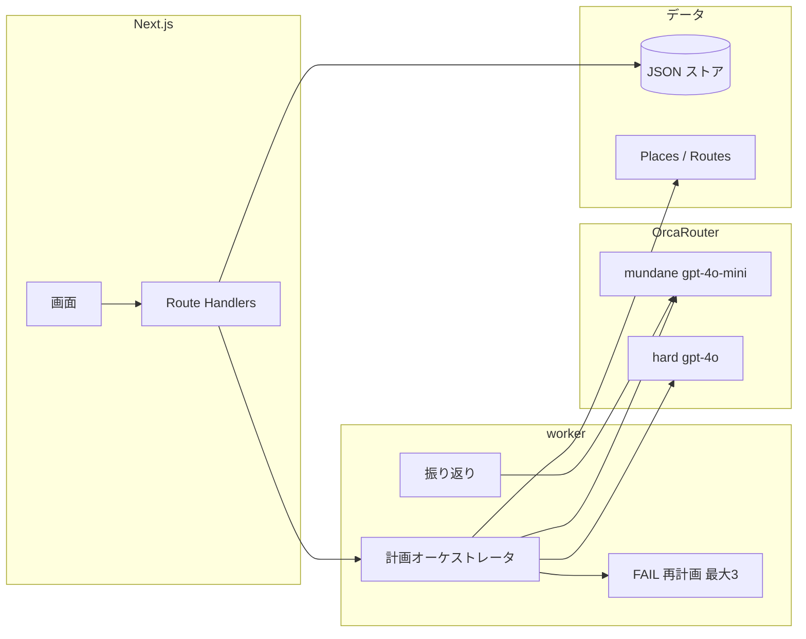

# ふたりログ

二人の希望を調整し、予定が崩れたら組み直し、確かめた記憶を次のデートに活かす Web アプリです。計画する側の1人だけが使います。相手用アカウントはありません。

このリポジトリの既定実行は **DEV（JSON ストア + 開発用トークン）** です。`APP_RUNTIME=LIVE` のときキーが無ければ BLOCKED であり、モックへ自動降格しません。LIVE 合格判定にはモックを使いません。推論は [OrcaRouter](https://docs.orcarouter.ai/getting-started/quickstart) 必須です。

## 起動

```bash
cp .env.example .env.local   # 秘密は入れない。ENABLE_DEMO_CONTROLS=true を確認
npm install
npm run dev                  # Next.js と worker を同時起動
```

http://localhost:3000

```bash
npm run typecheck
npm run lint
npm test
npm run build
npm run doctor          # PASS / FAIL / BLOCKED。秘密は出さない
npm run persist:diagnose:emu  # Cloud Agent: Emulator で読み書き（鍵不要）
npm run demo:emu:five         # Cloud Agent: Emulator 5連。LIVE 成功には数えない
npm run demo:live       # 通し 1 回（LIVE 合格は本物 Firestore のときだけ）
npm run demo:five       # ローカル LIVE 5 回。Emulator 成功とは別
npm run demo:chaos      # 空入力・矛盾希望・閉店・400/429/timeout・過去出発
npm run demo:reset      # 自分の isDemo データだけ。REPLAY は既定で残す
```

画面収録の固定入力は `docs/demo-script.md`。

## 構成



- Web は入力と承認。PENDING はローカルでは poller、Cloud Run では `POST /api/internal/jobs` が lease して実行する
- 公開は Cloud Run に実行 SA を割り当てる（鍵ファイルなし）。手順は `docs/deploy.md`
- 構造化抽出は mundane、最終行程・スキーマ失敗・大きな入力は hard
- Named Router `orcarouter/futari-*` は `/v1/models` に無ければ使わない（名前は捏造しない）

## 評価軸との対応

| 軸 | 対応箇所 |
|---|---|
| セキュリティ | プロンプト区切り（`promptFence`）、記憶インジェクション警告、AUTO_NOTIFY 許可リスト、ログマスク。テストは `tests/v08.test.ts` |
| コスパ | mundane/hard 明示ルール、呼び出しトレース（モデル・理由・トークン・費用・レイテンシ）、セッション JSON の合計一致 |
| 信頼性 | FAIL を成功に書き換えない。自動再計画は上限 3。LIVE はモックへ落とさない |
| 自律性 | 修復戦略の選択、スキーマ再試行→エスカレート、429/timeout の 1 回再試行。尽きれば人間へ返す |
| 独創性 | 承認した記憶が次の計画を変える。判断トレースで差分を見せる |

## デモの操作順

1. `/` でゲスト開始（Firebase 設定時は匿名ログイン）
2. `/today` で今日の候補カードを選ぶか、「候補なしで条件だけ入れる」
3. `/plan/new` で集合地点（名古屋駅 / 東京駅）を選び、二人の希望を入れて作成
4. 行程を確認。右（または「判断トレース」）でモデル理由・費用・再計画差分
5. 雨・遅延・満席はシナリオ注入（デモ UID のみ）
6. 振り返り原文 → 確認質問 → 記憶候補を承認（命令形は警告）
7. 「この記憶を使って次のプランをつくる」

## 環境変数

`.env.example` を参照。値は捏造しません。

| 変数 | 用途 |
|---|---|
| `APP_RUNTIME` | `MOCK`/`DEV`（既定）または `LIVE` / Emulator |
| `ORCAROUTER_*` | 実推論。Named Router が無いときはカタログ ID |
| `GOOGLE_MAPS_API_KEY` | Places New / Routes |
| Firebase `NEXT_PUBLIC_*` | 匿名 Auth。LIVE の Admin は `gcloud auth application-default login`。GAC は不要 |
| `WORKER_MODE` / `WORKER_INVOKE_URL` | ローカルは poller。Cloud Run は http。`docs/deploy.md` |
| `ENABLE_DEMO_CONTROLS` | シナリオ注入。LIVE では `DEMO_ALLOWED_UIDS` に限定 |
| `NOTIFY_ALLOWLIST` | AUTO_NOTIFY 送信先。既定 `in-app` |

## 既知の BLOCKED

- 東京の**発表会場**住所・最寄り駅は未提供。デモは名古屋駅 / 東京駅周辺を設定切替
- OrcaRouter Named Router `orcarouter/futari-*` は API から作成できず `/v1/models` にも無い
- Cloud Agent は Emulator。Emulator 成功を LIVE 成功としない。LIVE 5連はローカルのユーザー ADC
- LIVE の AUTO_NOTIFY は行程が PASS のときだけ。営業時間・料金 UNKNOWN の CONDITIONAL は自動適用しない
- コード・README に `sougi` 名称は残っていない。外部ダッシュボード側の旧名は利用者側の設定

進捗は `docs/implementation-status.md`、公式仕様確認は `docs/provider-verification.md`、LIVE 実測は `docs/live-results.md`。
